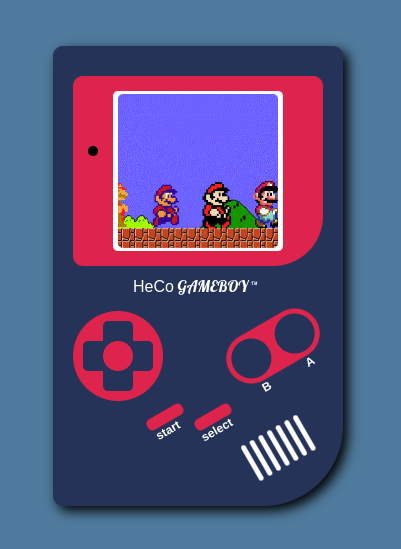

# Gameboy Design Project



Este projeto tem como objetivo desenhar um Gameboy utilizando apenas HTML e CSS.

## Índice

- [Visão Geral](#visão-geral)
- [Instalação](#instalação)
- [Uso](#uso)
- [Estrutura do Projeto](#estrutura-do-projeto)
- [Tecnologias Utilizadas](#tecnologias-utilizadas)
- [Contribuição](#contribuição)
- [Licença](#licença)

## Visão Geral

Este projeto visa recriar o design icônico do Gameboy original usando apenas HTML e CSS. A ideia é demonstrar como é possível criar layouts complexos apenas com as tecnologias básicas da web.

## Instalação

Para visualizar o projeto localmente, siga estas etapas:

- Clone o repositório:
  ```sh
  git clone https://github.com/seu-usuario/gameboy-design.git
  ```
- Navegue até o diretório do projeto:
  ```sh
  cd gameboy-design
  ```
- Abra o arquivo `index.html` em seu navegador preferido. Ou, caso esteja utilizando o editor VS Code, apenas inicialize o live server.

## Uso

Simplesmente abra o arquivo `index.html` em qualquer navegador da web. Você verá a reprodução visual de um Gameboy.

## Estrutura do Projeto

```sh
gameboy-design/
├── assets/
│   └── images
│            └── preview.png
│   └── main.css
│   └── app.js
├── index.html
└── README.md
```

## Tecnologias Utilizadas

- **HTML5**: Utilizado para a estrutura do projeto.
- **CSS3**: Utilizado para estilizar o projeto e dar forma ao design do Gameboy.
- **ES6**: Utilizado para inserir e controlar animações na interface.

## Contribuição

Contribuições são bem-vindas! Se você tem alguma ideia de melhoria ou encontrou um bug, sinta-se à vontade para abrir uma issue ou enviar um pull request.

1. Faça um fork do projeto.
2. Crie uma branch para sua feature ou correção (`git checkout -b feature/MinhaFeature`).
3. Commit suas mudanças (`git commit -m 'Adiciona MinhaFeature'`).
4. Faça push para a branch (`git push origin feature/MinhaFeature`).
5. Abra um pull request.

## Licença

Distribuído sob a licença MIT. Veja `LICENSE` para mais informações.
